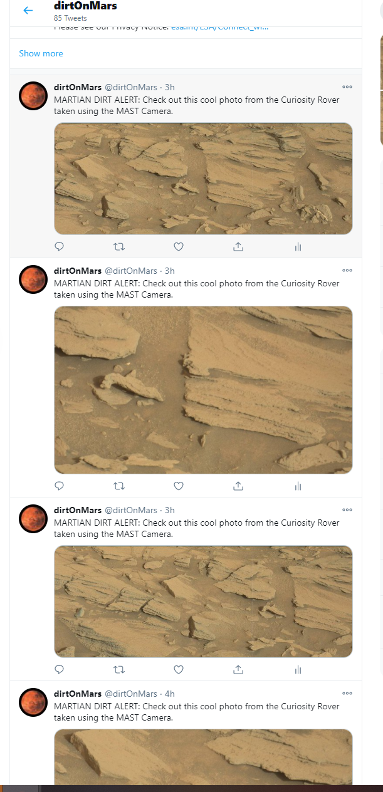

# Twitter Bot

A Twitter Bot located at <a href="twitter.com/dirtOnMars"><b>@dirtOnMars</b></a> on Twitter. It uses a NASA API to post photos from the Mars Curiosity Rover every 15 minutes.

## Disclaimer

I hold no liability for what you do with this bot or what happens to you by using this bot. Abusing this bot *can* get you banned from Twitter, so make sure to read up on [proper usage](https://support.twitter.com/articles/76915-automation-rules-and-best-practices) of the Twitter API.

## Dependencies

You will need to install Python's [python-twitter](https://github.com/sixohsix/twitter/) library:

    pip install twitter

You will also need to create an app account on https://dev.twitter.com/apps

1. Sign in with your Twitter account
2. Create a new app account
3. Modify the settings for that app account to allow read & write
4. Generate a new OAuth token with those permissions

Following these steps will create 4 tokens that you will need to place in the configuration file discussed below.

## Usage

### Configuring the bot

Before running the bot, you must first set it up so it can connect to the Twitter API. Create a config.py file and import twitter. Create a function that returns the API using the four tokens you recieved from your Twitter Developer account.
      
    import twitter
		
    def getApi():
    	return twitter.Api(consumer_key='yb33hvkIjNKu741ATZOj2LSEm',
                        consumer_secret='oFtlrhM723Yob7Spf4HOMRJyRFgMhdg2FU1yTnh5L8Hq1xpfLo',
                        access_token_key='1338233546172676098-V7FEIfTIz9w3NerLxS8LIVjTVqpKaW',
                        access_token_secret='Zljyyhm8GjM1SnOwAZ8wmXv9WNkcbb6XA4AvjobumAgdR')


### Create an instance of the bot

To create an instance of the bot. create a file called bot.py:

    import os
    from config import getApi
    
    api = getApi()

To test that your connection to Twitter is working, try running this simple status update function in the bot.py file.
```
def postTweet(update):
	status = api.PostUpdate(update)
	
postTweet("Hi, I'm a test tweet.") 
```

### Calling NASA API

You will need to generate an API key at https://api.nasa.gov/.

1. Retrieve key from your email.
2. Choose which NASA API that you will be using for your bot; I used "Mars Rover Photos".
3. Make a query to the API using the key. Here are some example queries from the NASA website. 

	* https://api.nasa.gov/mars-photos/api/v1/rovers/curiosity/photos?sol=1000&api_key=DEMO_KEY

	* https://api.nasa.gov/mars-photos/api/v1/rovers/curiosity/photos?sol=1000&camera=fhaz&api_key=DEMO_KEY

4. Replace DEMO_KEY with NASA key to access API.
5. Create function that tweet data that you queried. (See https://github.com/BriaWilliams/twitterBot/blob/main/twiterBot/bot.py)


### Future Project Updates:

* In the near future, I will actually deploy the Twitter bot so that it is no longer running from my local. This will make the bot truly independent. 

* I also want to have different text for the tweets so that the posts don't all have the exact same text.


  
    
## Have questions? Need help with the bot?

If you're having issues with or have questions about the bot, (https://github.com/BriaWilliams/twitterBot/issues) in this repository so one of the project managers can get back to you. 

